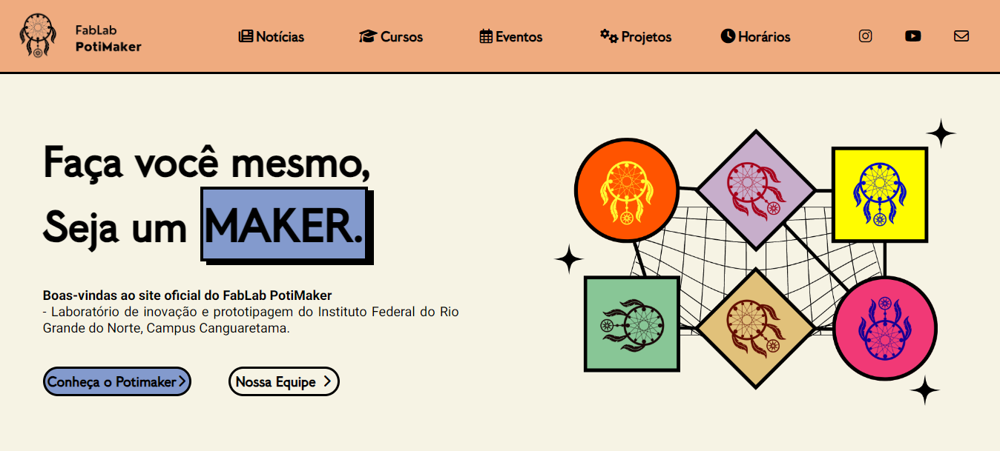

<h1> PotiMaker  </h1>

Site oficial do FabLab PotiMaker - laboratório de inovação e prototipagem do Instituto Federal do Rio Grande do Norte, Campus Canguaretama 
#

## Tecnologias

   
   
   
 

 ## Deploy
 Para acessar o site do PotiMaker clique <a href="https://potimaker-ifrn.github.io/sitePotimaker/index.html" target="_blank">aqui.</a>

